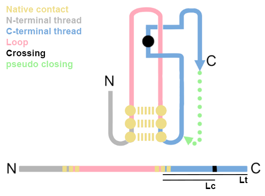

# Automated Entanglement Clustering  

Uses DBSCAN to cluster the resulting .pkl file generated from entanglement_analysis_v1.4.py   
Optimizes the DBSCAN parameters through iteration and then provides summary metrics for the optimal clusters  

The clustering can be applied to a single file or multiple .pkl files in a directory.  

NOTE: Dont cluster across multiple files unless they have the same sequence or are premapped  

# Packages required to run this script  
  
os, sys, numpy, time, scipy, itertools, pickle, sklearn, glob  

some of these are standard python packages and others will need to be installed. you can find how to install them by   
googling the package name and install  

# USAGE  

python automate_ent_clustering_v4.3.py [1] [2]  

[1] = path to .pkl input file resulting from entanglement_analysis_v1.4.py  
[2] = path to output file for summary statistics  

# Example command  

python automate_ent_clustering_v4.3.py 6u32_CP4.pkl 6u32_CP4.summary  

# OUTPUT
## File 1  
A summary file for each cluster resulting from the optimized DBSCAN is created at the specified output file  
it contains the following columns comma separated  

[1] label: cluster identification label  
[2] clust_size: # NC that have an entanglement present in cluster / total # NC in the protein with entanglement present  
[3] avg_ent_depth: average of the distribution of depths calculated for each crossing found in the cluster. the depth is defined by the following:  
- 1 - abs(0.5 - (Lc/Lt)) + (Lc/L)  
    - where Lc = the minimal number of residues between the native contact closing the loop and the crossing  
    - where Lt = the length of the thread  
    - where L = length of the protein  

[4] score = (clust_size + avg_ent_depth)  
[5] rep_nc: min and max of set of native contacts forming loops in the cluster.  
[6] rep_crossings: set of unique crossings in the cluster  
[7] rep_surr_res: set of unique residues within 8A of crossing residues in the cluster  
  
  
  
## File 2  
a pickle binary file containing a single dictionary with one entry for the reference state and a single entry for each frame analyzed in the trajectory  
    this file can be examined by launching an interactive python session and using the following commands  
    
    import pickle    
    with open('./test_outfiles/entanglement_analysis_1.4/output/6u32.pkl', 'rb') as fh:  
        data = pickle.load(fh)  
  
    for k,v in data.items():  
        print(k,v)  
  
the top level of the dictionary has keys in the form of a tuple (rank, label)  
where the rank is the rank of the labeled cluster stability by the score located in the summary output  
    
for example the following keys are orded by increasing rank   
Keys = (rank, label)  
(0,-1)  
(1,3)  
(2,1)  
(3,0)  
(4,4)  
(5,2)  
  
in each of these entires the value is another dictionary containing one entry for each input .pkl file that was used to create the total sample space  
  
for example lets take the cluster (0,-1) from the above example. This cluster has the lowest stability score and a label of -1. If we pull the data from  
6u32_CP_total_raw_clusters.pkl  

    >>> import pickle
    >>> with open('6u32_CP_total_raw_clusters.pkl', 'rb') as fh:
    ...     data = pickle.load(fh)
    ...
    >>> data.keys()
    dict_keys([(0, -1), (3, 0), (2, 1), (5, 2), (1, 3), (4, 4)])
    >>> data[(0,-1)]
    {'inpfiles/6u32_CP4.pkl': {(245, 268): [array([ 0.71999043, -0.02601206 ]), [[241, 238], []], [[126, 127, 139, 173, 236, 237, 239, 240, 242, 243, 244, 245, 246, 249, 262, 263, 264, 265, 266, 267, 268, 269, 271], []]]}, 'inpfiles/6u32_CP5.pkl': {(244, 267): [array([ 0.71762111, -0.03132963 ]), [[240, 237], []], [[125, 126, 138, 172, 235, 236, 238, 239, 241, 242, 243, 244, 245, 248, 261, 262, 263, 264, 265, 266, 267, 268, 270], []]]}}
    >>> for k,v in data[(0,-1)].items():
    ...     print(k,v)
    ...
    inpfiles/6u32_CP4.pkl {(245, 268): [array([ 0.71999043, -0.02601206 ]), [[241, 238], []], [[126, 127, 139, 173, 236, 237, 239, 240, 242, 243, 244, 245, 246, 249, 262, 263, 264, 265, 266, 267, 268, 269, 271], []]]}
    inpfiles/6u32_CP5.pkl {(244, 267): [array([ 0.71762111, -0.03132963 ]), [[240, 237], []], [[125, 126, 138, 172, 235, 236, 238, 239, 241, 242, 243, 244, 245, 248, 261, 262, 263, 264, 265, 266, 267, 268, 270], []]]}

there are two source files here: inpfiles/6u32_CP4.pkl inpfiles/6u32_CP5.pkl  
and each contributed a single entanglement to this cluster. This makes sense as the -1 cluster label is reserved for noise samples that   
dont cluster well with any core sample. The entanglement info has the following data structure  

key = (residues invovled in native contact)  
value = [array containing partial linking values for the N and C termini for this native contact,  
         array containing the N and C terminal crossings for this native contact,  
         residues within 8A of the crossing residues]  

so for example if the key value pair in the reference state returned this  
(245, 268): [array([ 0.71999043, -0.02601206 ]), [[241, 238], []], [[126, 127, 139, 173, 236, 237, 239, 240, 242, 243, 244, 245, 246, 249, 262, 263, 264, 265, 266, 267, 268, 269, 271], []]]  
the native contact formed by the residues 245 268 has an entanglement present.  
the partial linking value of the N terminus is 0.71999043 indicating a entanglement is present.  
the partial linking value of the C terminus is -0.02601206 indicating no entanglement is present  
Therefor the C terminus should not have a crossing while the N terminus should and indeed does at residue 238 and 241  
The residues who have alpha carbons within 8A of the crossing residues are reported last  
  
  
# Explination of clustering  

The set of native contacts that have an entanglement present was clustered with the Desnity Based Spatial Clustering of Applications with Noise.  

## Basics of how the algorithm works:  
- obviously a density based algorithm that views the space as populated by areas of high and low densities of points (in this case NC pairs)  
- we first standardize our data by removing the mean and scaling to unit variance.  
- it finds core samples that have a minimum  number of samples surrounding it.  
- then it creates clusters of sets of core samples that share or are them selves common neighbors  
- any points that are greater than eps away from any core sample are considered noise and given a cluster label of -1  
- all other clusters are labeled starting from 0  
  
## Basics of automating DBSCAN  
- there are two metrics the user supplies the algorithm  
    1. eps: the distance threshold between two points to determine if they are in the same neighborhood.  
    2. min_samples: the number of samples in the neighborhood of a point for it to be considered a core_sample.  
- to find the optimal pair of values we iterate of each pair of (eps, min_samples) set of parameters and calculate a clustering quality score  
    - Mean silhouette score = < ( b - a ) / max( a, b ) >s  
        - where a is the mean distance between a sample s and all other points in the same cluster  
        - where b is the mean distance between a sample s and all other points in the next nearest cluster  
- The mean silhouette score reaches a maximimum when the clusters are well defined in space (i.e. little over or under clustering)   
    - therefore the optimal pair of (eps, min_samples) parameters will occure when the mean silhouette score is at a maximum.   
    - for more info about the [mean silhouette score](https://scikit-learn.org/stable/modules/clustering.html#silhouette-coefficient)  

## Why is it appropriate to choose DBSCAN for the clustering of native contacts that have entanglement present?  
1. DBSCAN finds clusters of any shape   
2. it can find outliers that may represent very weak entanglements only containing a single native contact forming the loop  
3. it forms clusters in a more intuitive way than basic density clustering  

For a good explination of [DBSCAN](https://scikit-learn.org/stable/modules/clustering.html#dbscan)  
